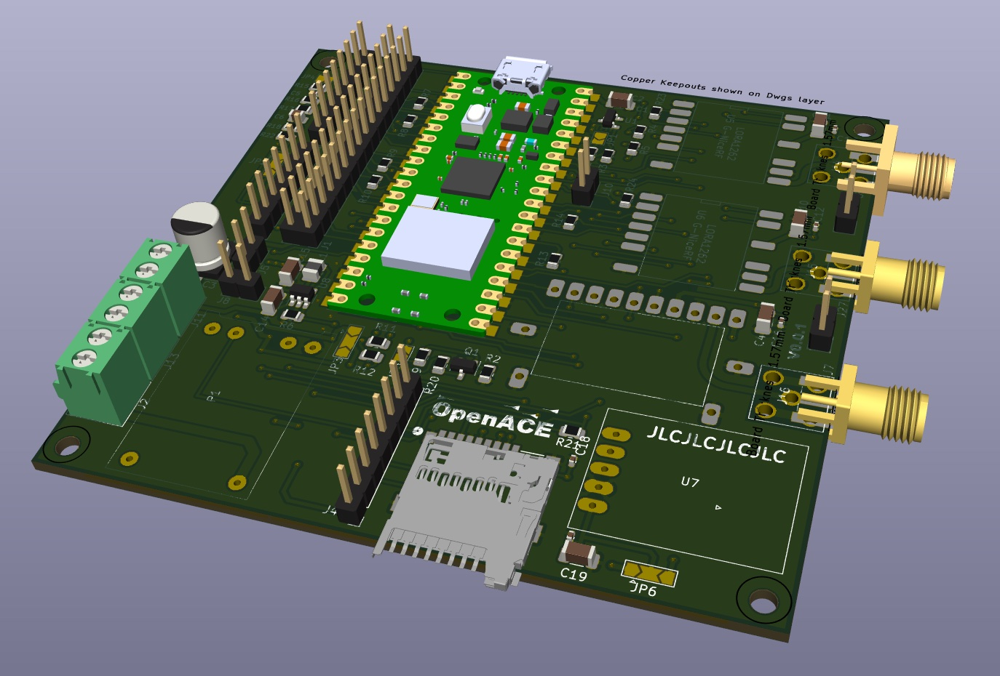
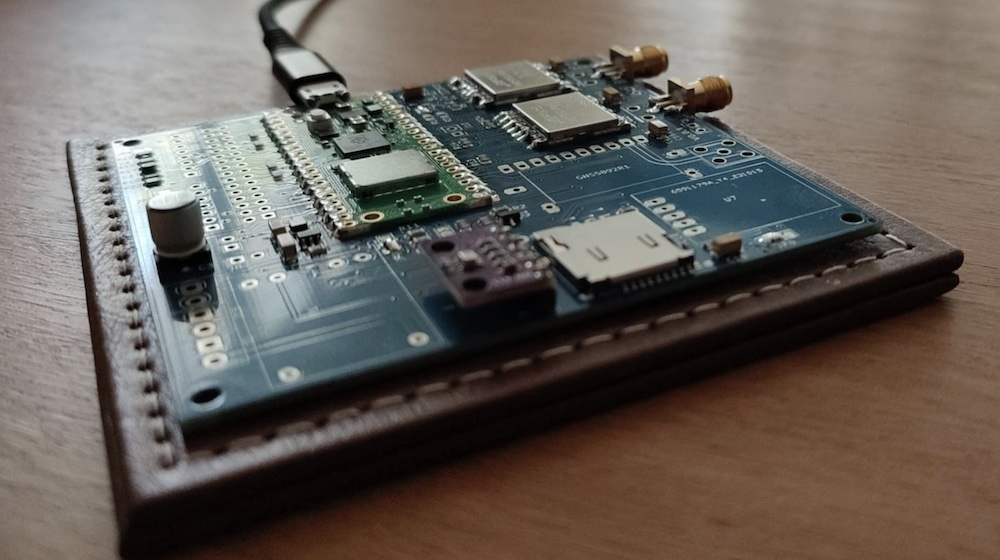
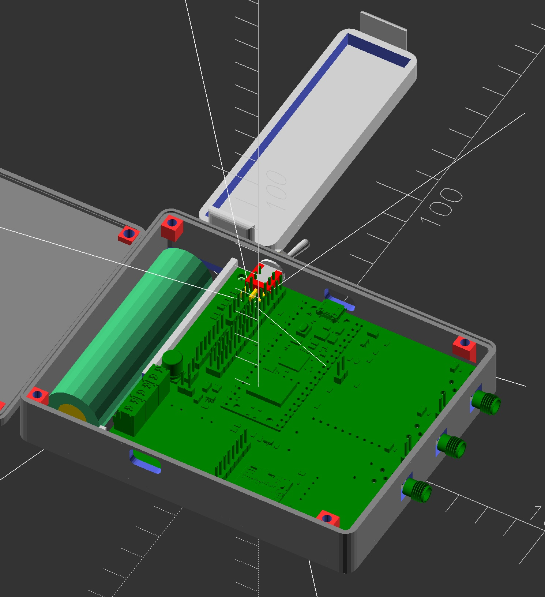
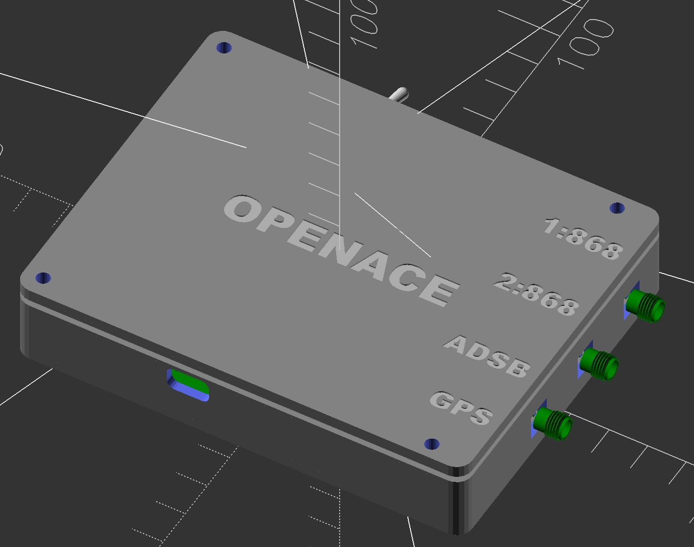

# OpenAce Conspicuity Device

> **_NOTE:_**:
> I am in the process of uploading the necessary files to GitHub. More will be added soon, including the ~~OpenSCAD enclosure~~ [enclosure](https://github.com/rvt/OpenAce/tree/initial/enclosure), ~~KiCAD PCB files~~ [Schematic/PCB](https://github.com/rvt/OpenAce/tree/initial/OpenACE%20V0.0.2), unit tests for the source code, and additional resources.

> [!TIP]
> Please visit the [OpenAce WIKI](https://github.com/rvt/OpenAce/wiki) for build information.

The OpenAce Conspicuity device is designed for General Aviation pilots flying in areas where multiple protocols, such as OGN, Flarm, and ADS-L, are used. It can transmit and receive multiple protocols simultaneously (excluding sending ADS-B) using one or more transceiver modules. All received traffic is sent to your Electronic Flight Bag (EFB), such as SkyDemon, via the GLD90 protocol.

The device is built around the Raspberry Pi Pico 2040 and can be configured with a custom PCB that supports either two transceivers or a simpler configuration with one. In both setups, it can send and receive all protocols using time-sharing technology. The device can store configurations for multiple aircraft, which can be selected through an easy-to-use web interface.

Powered by a Li-Ion battery, the device includes a PCB with a USB-C charger. The estimated battery life is between 4 and 6 hours, though this is subject to further testing.

|        |               |
| ------------------------------------------------- | ----------------------------------------------------- |
|  |  |

## Radio Protocol Support

Radio Protocol is the method used to communicate with other conspicuity devices

| Radio Protocol | Send               | Receive            | Multi Protocol\*   |
| -------------- | ------------------ | ------------------ | ------------------ |
| OGN            | :heavy_check_mark: | :heavy_check_mark: | :heavy_check_mark: |
| ADS-L          | :heavy_check_mark: | :heavy_check_mark: | :heavy_check_mark: |
| Flarm (2024)   | :heavy_check_mark: | :heavy_check_mark: | :heavy_check_mark: |
| ADS-B out      | :no_entry:         | :heavy_check_mark: | :heavy_minus_sign: |
| PAW            | :construction:     | :construction:     | :construction:     |
| FANET          | :construction:     | :construction:     | :construction:     |

\* Multi Protocol is a feature of OpenAce that allows to enable multiple protocols both send and receive on a single transceiver my sharing the air time. The Tranceiver will alternate between the different protocols and prioritice a specific protocol when it receives data for that protocol.

### Communication support

Communication support is what protocols are supported to other devices like electronic flight bags or other equipment.

| Protocol   | Send UDP over WIFI | Send UDP over Bluetooth |
| ---------- | ------------------ | ----------------------- |
| GDL90      | :heavy_check_mark: | :construction:          |
| AirConnect | :construction:     | :construction:          |

### Tested with Electronic Flight Bag

OpenAce is currently tested with SkyDeamon only,  If you made it work with any other software on Phone or Tabled, do let me know so I can add or help out ot make this work.

| EFB       | GDL90 over WIFI    | GDL90 over Bluetooth |
| --------- | ------------------ | -------------------- |
| SkyDeamon | :heavy_check_mark: | :construction:       |

The PCB measures approximately 8x9 cm.

## External Libraries and frameworks used

Most libraries are used 'as-is' Some of them have been slightly modified for performance reasons, compatibility or other reasons.

1. Raspberry PI PICO SDK [https://github.com/raspberrypi/pico-sdk](https://github.com/raspberrypi/pico-sdk)
2. FreeRTOS, OpenAce uses tasks and timers and avoids loops and runs in multi-core SMP mode. [https://www.freertos.org](https://www.freertos.org)
3. LWiP Pretty cool and sometimes confusing TCP/IP protocol suite [https://savannah.nongnu.org/projects/lwip/](https://savannah.nongnu.org/projects/lwip/)
4. ArduinoJSON for loading and storing configuration [https://arduinojson.org](https://arduinojson.org)
5. etlcpp pretty awesome library written by John Wellbelove [https://www.etlcpp.com](https://www.etlcpp.com)
6. libcrc [https://github.com/lammertb/libcrc](https://github.com/lammertb/libcrc)
7. minnmea for parding NMEA sentences [https://github.com/kosma/minmea/](https://github.com/kosma/minmea/)
8. Catch2 for unit testing [https://github.com/catchorg/Catch2](https://github.com/catchorg/Catch2)

# OpenAce Disclaimer

> [!IMPORTANT] > **Important Notice: Use at Your Own Risk**
>
> The OpenAce Conspicuity Device is provided "as is," without any guarantees or warranties of any kind. By using this device, you acknowledge and agree that:
>
> 1. **No Warranty**: The creators of OpenAce make no claims or guarantees regarding the accuracy, reliability, or fitness for a specific purpose of the device or its associated software. This includes, but is not limited to, communication with OGN, Flarm, ADS-L, or any other protocols.
> 2. **Assumption of Risk**: You assume full responsibility for any and all risks associated with the use of OpenAce. This includes, but is not limited to, risks related to hardware malfunctions, software issues, or incorrect transmission/interpretation of data.
> 3. **Limitation of Liability**: Under no circumstances shall the creators, contributors, or affiliates of OpenAce be held liable for any direct, indirect, incidental, or consequential damages resulting from the use, misuse, or inability to use the device or its software.
> 4. **General Aviation Use**: OpenAce is intended for use in General Aviation environments where multiple protocols such as OGN, Flarm, and ADS-L are used. It is **not certified** for professional or commercial aviation use and should not be relied upon as the sole source of traffic or navigation information.
> 5. **Compliance**: Users are responsible for ensuring that the use of OpenAce complies with local aviation regulations and requirements. It is your responsibility to ensure that the device operates within the legal limits and safety standards for your jurisdiction.
>
> By using OpenAce, you agree to the terms of this disclaimer and acknowledge that you are using the device and its software at your own risk.
