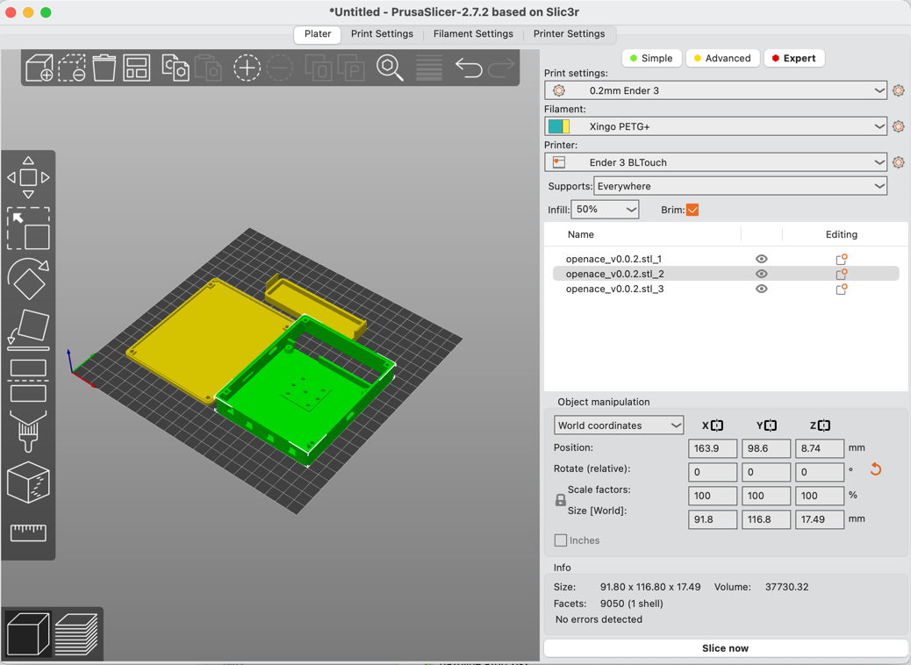

# Enclosure

* `Filename: openace_v0.0.2.scad`
* `Material: PETG or other material that does not get elastic under higher temperatures`
* `Layer Height: 0.2mm`

> **_NOTE:_**
> Currently only the 'full' (two tranceiver) version is included and I am working on a enclosure for the Lite version.

To open the `*.scad` file you need to use the latest version of [OpenSCAD](https://openscad.org). 
From OpenSCAD you can directly export an STL for 3D printing, or make your modifications if needed.
If you have any cool or usefull modifications do let me know, I would love to hear them!

.

## How to 3D print

From OpenSCAD from the menu use `Design -> Render`, this might take a few seconds depending on your CPU.
Then export the file as STL using `File -> Export -> Export as STL`, then in your favorite slicer import the STL and print.

I use PrucaSlicer (although I still have an old Ender 3), but the output files will look something like the below image.

).

## Generating a stl file from the KiCAD board to be used in OpenSCAD

From KiCAD menu export the board as step with the following settings: ). 
I use `openace.step`, but any other name should be file.
Then use [imagetostl.com](https://imagetostl.com/convert/file/step/to/stl#convert) to convert the STEP to a STL type file.

# 868Mhz antenna array

* `Filename: 868Mhz-antenna-array.scad`
* `Material: PETG or other material that does not get elastic under higher temperatures`
* `Layer Height: 0.2mm`

> **_NOTE:_**
> Build Instructions will follow as they require a tiny filter that requires a PCB still to make the build easer.

The 868Mhz Antenna array can be used if you want to put OpenAce at a different location than your Antenna's. For Example if you fly a Cessna you just might want to only have the Antenna's (GPS/868Mhz/ADS-B) antenna on your windows instead of the whole case.
They are 'indoor' antenna's.
THis design include a small 'rig' to bend the copper wire in the right shape and form.

Note: You could also use them on your OGN station instead of a wip antenna

.

# GPS Holder

* `Filename: gps-antenna-holder.scad`
* `Material: PETG or other material that does not get elastic under higher temperatures`
* `Layer Height: 0.2mm`

> **_WARN:**
> To print in prusa set _Print settings → Support material → Don't support bridges._

There are two way's to use GPS in OpenAce. An external 'pug' antenna with SMA connector, or an rotatable ceramic
GPS antenna that can be mounted on the enclosure itself. What GPS antenna to use when can be found in the build instructions.
This design is for the GPS antenna attached to the case. This is ideal for situations where OpenAce has clear view
of the sky mounted upright, or horizontal.

The below screenshots are of the Antenna with aN [TopGNSS Gps Galileo Glonass Beidou](https://nl.aliexpress.com/item/1005002475354983.html) ceramic Antenna.

.

Parts setup in [PrusaSlicer](https://www.prusa3d.com/page/prusaslicer_424/) example:

.

