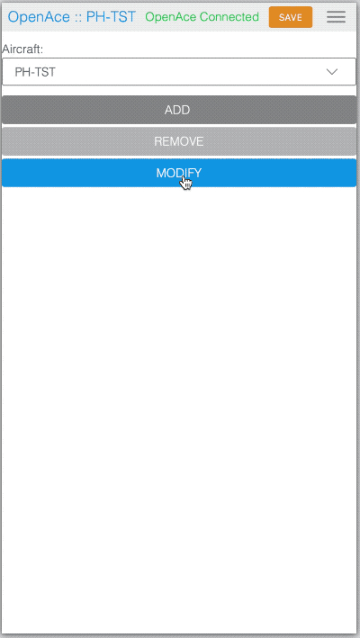

# Overview

This directory, along with its subdirectories, contains the necessary files for developing components of the web interface for OpenAce. If you're not working on the UI development, no additional steps are required—the C/C++ source files already integrate the web interface.

All files in the `SystemGUI/dist` directory are automatically packaged into `src/lib/webserver/openace_fsdata.c`.

# Libraries and fromworks used

1. `@frameable/e` LitElement alike framework to create and use webcomponents [https://github.com/frameable/el](https://github.com/frameable/el)
1. `@ggedde/spry-css` Minimalistic css framework for small footprints [https://ggedde.github.io/spry-css/](https://ggedde.github.io/spry-css/)
1. `just-validate` Form validation framework [https://just-validate.dev](https://just-validate.dev)

# Quick Start for UI Development

1. Ensure you have `npm` or `yarn` installed on your system, then run `npm install` in the `SystemGUI` directory.
2. Connect the OpenAce hardware to your local network by enabling the `WifiService` and confgure OpenAce to connect to your network
3. In the `.proxyrc.js` file, update the `target` variable with the device’s IP address. OpenAce will print the IP address over Serial line USB or Debug mode
4. The UI will be accessible at `http://localhost:1234` if the device is running and connected to the network.
5. To start development, run `npm start`. Changes made to the code will be instantly reflected on the UI.
6. Once development is complete, run `npm run build` to generate a distribution in the `dist` directory. Rebuilding OpenAce with `cmake` will include the necessary UI files.

# Files

- `.proxyrc.js` proxy setting to direct API calls to OpenAce for hot re-loading en testing of the UI
- `.parcelrcrelease` Release configuration using in the build process to compress using gzip
- `package.json` npm package file
- `src` Directory containing the project files with css and various components
